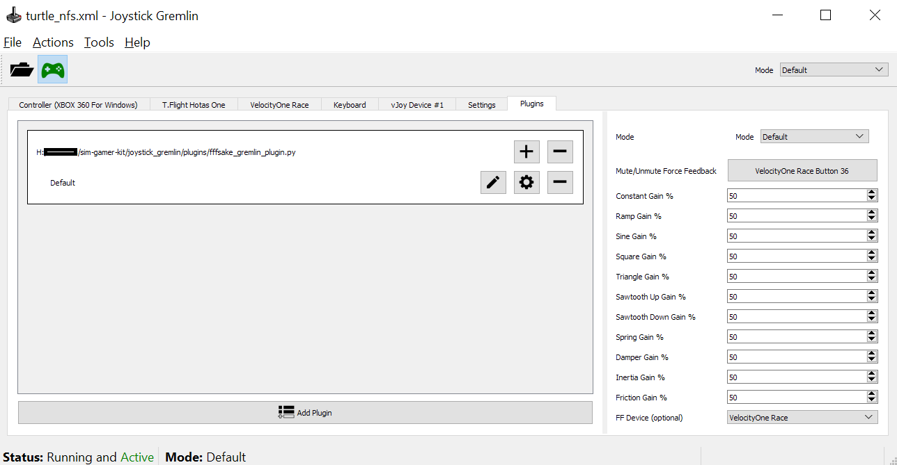

[//]: # "© 2025 Code Monet <code.monet@proton.me>"

# FFFSake

> Through this document, FFB is used as an acronym for Force Feedback.

`FFFSake`, or **F**or **F**orce **F**eedback's **Sake**, is:

*   Technically, a
library that can bridge FFB commands received by vJoy to a
DirectInput-compatible device.
*   Practically, a plugin to get FFB effects on your
physical device while your game is actually being played with a
vJoy virtual joystick, which is in turn being fed with inputs by an
application like Joystick Gremlin.

# What is this for?

> tl;dr if you're having a wheel/joystick binding, input, or FFB
problem, [Joystick Gremlin](https://whitemagic.github.io/JoystickGremlin)
with `FFFSake` can usually help you work around that.

In a perfect world, your game controller (typically a racing wheel or
joystick/HOTAS, plus additional hardware like pedals, H-shifter etc.)
would allow configuring **inputs** in ways that work for everyone. They would
also correctly implement **outputs** i.e., the
[FFB
specification for DirectInput devices](https://learn.microsoft.com/en-us/previous-versions/windows/desktop/ee417563(v=vs.85))
**completely** and **correctly**, so that the player gets the game developers'
intended experience.

Meanwhile, the game you're playing would have a nice configurable control
scheme. It would allow you to tune your FFB experience based on
your preferences and your specific hardware.

In the real world, both hardware and software can fall short or fail at these
for a variety of reasons. This is where third-party tools like Joystick Gremlin
and vJoy come in. You configure your game to use the vJoy virtual joystick as a FFB
capable input device, and use [Joystick Gremlin](https://whitemagic.github.io/JoystickGremlin)
to read control inputs from
various sources (say, your physical steering wheel), and "feed" them into the
vJoy virtual joystick. This allows you to fix a broad range of input-related
issues, such as:

1.  Setting response curves for analog axes, usually pedals.
2.  Configuring buttons and switches as toggle or sticky.
3.  Converting split pedals to combined or vice versa (for using modern racing pedals with flight sims or older racing games)
4.  Macro playback
5.  Combination inputs
6.  Mode switches

`FFFSake` handles the output i.e. FFB side of things, taking these commands
from the vJoy device (coming from the game) and writing them to your physical
FFB capable device. In this process, it can also fix various force
feedback issues and allow some amount of tweaking; see the Features section later.

## Why Joystick Gremlin?

While there are other applications with similar functionality, feeding vJoy with
inputs from DirectInput devices, none of them appear to be maintained by the time of
this writing.
[Joystick Gremlin](https://whitemagic.github.io/JoystickGremlin) is actively being
developed; we will be using the older but stable R13 version.

Support could be added for other vJoy feeders, especially if someone is willing to
help integrate `FFFSake` as a DLL or Python module into the feeder. Please get in touch
via
[GitHub Discussions](https://github.com/code-monet/sim-gamer-kit/discussions).

## Setup

Budget about 15-45 minutes for this one-time setup.

Using FFFSake requires the following third party dependencies. First,
download them all:

1.  vJoy virtual joystick driver. Please download the latest signed
    driver from
    [Brunner Innovation's fork on GitHub](https://github.com/BrunnerInnovation/vJoy/releases). Download both the setup executable as well as the `SDK.zip` archive.
2.  [Joystick Gremlin](https://whitemagic.github.io/JoystickGremlin/download)
3.  (Strongly Recommended) [HidHide](https://github.com/nefarius/HidHide/releases),
    a kernel-mode filter driver to hide physical devices from games. You
    will probably have a lot of trouble configuring your game to use vJoy,
    or using `FFFSake`, if you don't hide the physical device redirected through
    vJoy from the game. HidHide is the best option, at the time of this writing.

Install and configure these:

1.  Install vJoy. You can skip the reboot, doing it after the next step.
2.  Install HidHide and reboot.
3.  Install Joystick Gremlin, or use the "portable" version.
    1.   Joystick Gremlin ships with support for an older version of the vJoy DLL, not
         the one we want to use. First, navigate to the directory where you have
         installed/extracted Joystick Gremlin. Look for a file named
         `vJoyInterface.dll`, rename it to something like `vJoyInterface.old.dll`.
    2.   From the vJoy SDK zip archive you downloaded earlier, extract
         `SDK/lib/x86/vJoyInterface.dll` to the above path, taking the place of
         the original DLL that Gremlin shipped with.
    3.   Launch Joystick Gremlin and ensure it starts.
    4.   Close Joystick Gremlin for the next step.
4.  Launch the `Configure vJoy` app from the Start Menu and configure vJoy. The
    recommendation on the Joystick Gremlin page is a bit outdated; instead,
    I suggest having it match the screenshot below.

5.  Launch and
    [configure Joystick Gremlin](https://whitemagic.github.io/JoystickGremlin/quickstart/):
    1.   Suggestion for new users: verify that your plugged in physical device shows
         up; switch to that tab. From the `Actions` menu, create a 1:1 mapping. Scroll down
         the list and verify that a 1:1 mapping was created (usually works
         as long as you start with a clean slate i.e. zero existing mappings).
         [Joystick Gremlin Quickstart](https://whitemagic.github.io/JoystickGremlin/quickstart)
         has more details for this step.
    2.   Switch to the `Plugins` tab. Use the `Add Plugin` button and browse to
         the `joystick_gremlin/plugins/fffsake_gremlin_plugin.py` file,
         at the location you extracted Sim Gamer Kit to.
    3.   Once the plugin has been added, click on the cog wheel for the plugin to
         open its configuration. From the `FF Device` dropdown in
         plugin configuration, ensure your FFB capable device is selected. Most
         people would have exactly one such device.
    4.   [NOTE: only `reducing` engine is available in initial alpha releases].
         Select either the `forwarding` or the `reducing` engine. See section
         below for details. If you're not sure, start with the `reducing` engine
         if using a wheel and `forwarding` if using a joystick.
    5.   Bind a button for `Mute/Unmute Force Feedback`. Think of this as a safety cutoff
         button, to be pressed if you lose control of your FFB device. For this reason, use a button
         not on the FFB joystick/wheel. It doesn't need to be on the FFB device either.
         Once done, the plugin page should look something like the follows, minus
         the `Running and Active` status (we'll do that later): 
    6.   Save the profile.
    7.   Close Joystick Gremlin for the next step.
6.  Launch and
    [configure HidHide](https://github.com/nefarius/HidHide?tab=readme-ov-file#user-guide):
    1.   Decide if you want to use list all the games you want to use with vJoy
         (**allowlist**, "Inverse cloak" unchecked), or list all the games and
         applications you won't be using with vJoy (**blocklist**,
         "Inverse cloak" checked). I use the blocklist because that list is shorter
         for me.
    2.   Add paths to all the applications that belong to the above list. For
         games with launchers, you want the game binary path, not the launcher.
         I typically launch the game, and then use Windows Task
         Manager (launch via `Ctrl + Shift + Esc`) to find the path of the
         application `.exe` file. The applications tab should look something like:
         
         1.   If using an **allowlist**, make sure to add paths to Joystick
              Gremlin as well as the control panel/configuration application
              for your physical device.
    3.   On the devices tab, select the physical device (needs to be plugged
         in to show up) that you want to use through Joystick Gremlin.
    4.   Check "Enable filtering" and unplug-replug (or power off/on) the
         device.
         
7.  Launch Joystick Gremlin, ensure that your physical device is still there.
    If not, double check that you added the Joystick Gremlin application path
    correctly (if you're using the allowlist approach) in HidHide. Then click on
    "Enable" button.

This is a lot of setup; if you made it this far, congratulations! You've
enabled some really powerful tools for your sim gaming journey. I suggest starting
with a single Joystick Gremlin profile and then branching out to more as you gain
experience with these tools.

## Usage

Once you've completed the above one-time setup, future usage involves
(do all these **BEFORE** starting your game):

1.  Launching HidHide and ensuring the filter is enabled.
2.  Launch Joystick Gremlin and load your desired profile.
3.  Optional: Set gain percentages for hardware force feedback effects. Games typically
    use a subset of these, so changing them may not have an effect. The
    [game guides](../game_guides/index.md)
    have recommended settings for some games. The default value is 50%. See the
    [game issues guide](../game_guides/issues.md) for why you might want to change these.
4.  Click on `Activate`. `FFFSake` will activate if it's a plugin loaded for this profile.
    1.  With the profile active, you can use the button you bound earlier to toggle muting.
    `FFFSake`. `Tools` > `Log Display` > `User` will show a message when `FFFSake` is
    turned on or off.

At this point you can launch your game and configure it for vJoy. You should be
able to select and configure it inside the game as you would a physical controller.

### FFFSake Features

`FFFSake` has two "engines" that connect the FFB commands received by the vJoy
device to your physical FFB-capable controller. They do this in rather different
ways, as described below.

#### Forwarding Engine

The `forwarding` engine takes FFB commands received from vJoy (coming from
the game or from Windows) and writes them to the physical device using DirectInput.
In this process, the common compatibility fixes, described later, are also applied.
This engine has relatively lower CPU usage but cannot fix all compatibility issues.

#### Reducing Engine

The `reducing` engine takes FFB commands received from vJoy (coming from
the game or from Windows) and "reduces" them to a stream of constant forces, which
are written to the physical device using DirectInput. This way the above common and
following additional compatibility issues can be fixed:

1.  Incorrect [hardware effects](https://learn.microsoft.com/en-us/previous-versions/windows/desktop/ee417541(v=vs.85))
    in the physical device. See also
    [types of FFB issues](../game_guides/issues.md).
2.  More accurate "slip" if the application command rate exceeds what the device can
    handle.

#### Common Features

Both engines have the following features:

1.  Fix incorrect rotation of effects on racing wheels (but see also:
    [Indirect Input](../indirect_input/index.md))
2.  "Slip" FFB commands when they are issued faster than the device can handle them,
    usually leading to a drop in FPS in game when using a FFB device.
    1.   On slower CPUs, the `forwarding` engine is currently better for this. With
         planned future optimizations, the `reducing` engine will always be the
         superior option for this feature.
3.  Setting gain for individual hardware effects (requires re-`Activate` in Gremlin).

## Limitations and Known Issues

The following limitations exist because I don't know of any gamers who are affected by
them; if you are, please in touch via
[GitHub Discussions](https://github.com/code-monet/sim-gamer-kit/discussions)

1.  Only one vJoy device is currently supported.
2.  Only single FFB axis devices are supported in the `reducing` engine. In other
    words, it's only expected to be used for racing wheels. I don't know of any
    FFB joysticks that have mistakes in their hardware effects implementation.

The following known issues and planned features will be addressed
in a future release:

1.  Decrease CPU usage, especially for the `reducing` engine.
2.  Only single FFB axis devices are supported in the `forwarding` engine. In other
    words, it's only expected to be used for racing wheels. It's relatively easy to
    add support for (two axes) FFB joysticks, it's just currently lower
    priority given how rare such devices are.
3.  Some effects (friction and inertia, mainly) in the reducing engine could be refined.
    These effects are not commonly used.
4.  Ability to adjust gains of hardware effects via the Gremlin plugins UI for both
    engines.
5.  The `FFFSake` pluging may need to be removed and re-added to a profile if you
    change your FFB device.

## Troubleshooting

The plugin publishes some messages via the Joystick Gremlin logging system, which you can
view in the latter by going to `Tools` > `Log Display` > `User`.

`FFFSake` generates an error log file in the directory where Joystick Gremlin is running
from. If you run into an issue and the file contains errors or warnings, please open a
GitHub issue attaching the log file.

If force feedback cuts out or you seem to suddenly be missing effects, try Alt-tabbing out
of the game and then getting back into it, this should generally fix the problem. Please
check the `FFFSake` log for errors and send feedback via GitHub.

Section to be filled out based on user experience. Please share yours via the
[GitHub Discussions](https://github.com/code-monet/sim-gamer-kit/discussions) page!
