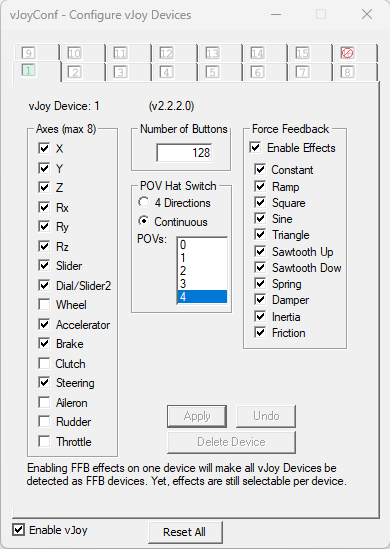
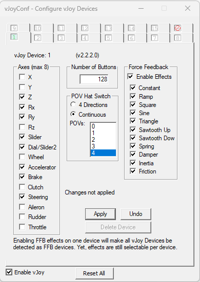

# vJoy Configuration

> Note: The configurations below have only been verified with DirectInput8 games on Windows 10 and 11.
> Games using older versions of DirectInput haven't been tested.

## For Driving Games

This configuration is recommended for driving games, as it allows
vJoy to be detected as a wheel by DirectInput. It should also work fine with non-driving games.

## All Other Games

The above configuration *might* cause an issue with non-driving games, in which case, use the
following instead (the only difference is that `Accelerator`, `Brake` and `Steering` are not enabled):

# Technical Details

If you're wondering why the first configuration has more than 8 axes: the 8 axes limit is not for HID
devices, but rather is a DirectInput limitation. It was probably (once?) a limitation in (the default HID
driver shipped with?) Windows as well.

Using that configuration creates a valid vJoy HID device, and DirectInput ignores the additional axes.
There should generally be no issues in games, and it works with Joystick Gremlin R13 as well. You will
map one of the first 8 axes in-game as accelerator, brake, clutch and steering.

## Optimal "Driving" Configuration

This is the optimal configuration for driving games i.e. maximum axes enabled; steering, brake and
accelerator get mapped to X, Y and Rz axes and you get the maximum 8 axes:

However this isn't currently supported by Joystick Gremlin R13.

## What about "Clutch"?

I couldn't get the "clutch" to work with DirectInput, so it's excluded from all configurations above.
You should still be able to map some other axis in-game as a clutch.
