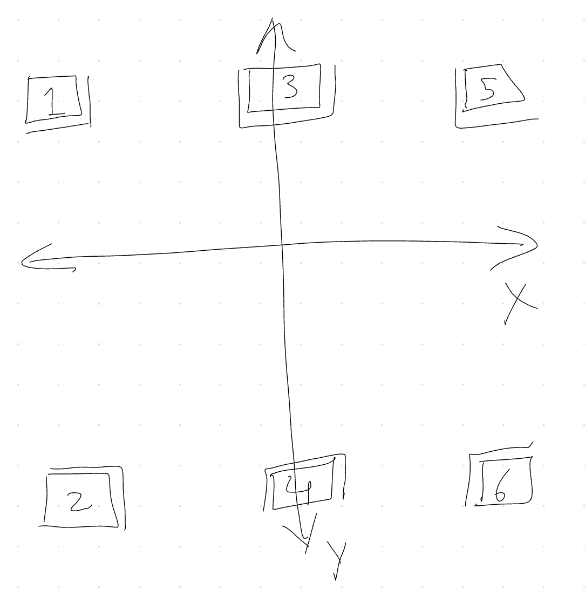

[//]: # "© 2025 Code Monet <code.monet@proton.me>"

## Joystick as H-shifter

This plugin will let you use a 2-axis joystick as a 6 position H-shifter in
your driving game.

### Setup

In your desired Joystick Gremlin profile, go to the `Plugins` tab and add
the H-shifter plugin (`joystick_gremlin/plugins/h_shifter.py`). The following
configuration is needed:

*   `Neutral` - Physical button to set gear to neutral. Needed for self-centering axes.
*   `Reverse (input)` - Physical button to set gear to reverse. Needed because we only
    have 6 positions via the axes.
*   `Left-right axis` - Physical left-right axis to use for H-shifter.
*   `Up-down axis` - Physical up-down axis to use for H-shifter.
*   `Gear 1` - vJoy button to use for gear 1.
*   `Gear 2` - vJoy button to use for gear 2.
*   `Gear 3` - vJoy button to use for gear 3.
*   `Gear 4` - vJoy button to use for gear 4.
*   `Gear 5` - vJoy button to use for gear 5.
*   `Gear 6` - vJoy button to use for gear 6.
*   `Reverse (output)` - vJoy button to use for reverse.

An experimental setting can be offered in a future release, currently not implemented:

*   `Axes are self-centering`: Defaults to `True`, used when the axes are
    self-centering with a spring, False if they don't return to neutral
    without user input (e.g. if you dialed up the clutch or loosened the
    spring). This is not how I use it, but you might want to experiment.

### In game usage

I suggest enabling the profile with this plugin, open "Input Viewer"
in Joystick Gremlin, and play with the joystick to induce H-shifter transitions.

Here's a lazily scribbled diagram for the exactly two people that will try
to use this plugin:

With the `Axes are self-centering` plugin configuration set to `True`,
moving the joystick to one of the six gear "regions" will cause the
corresponding vJoy button to be pressed and held, even if the joystick
returns to center.

> The double lines at the edges of each region show the "transition" zone,
which is used to emulate a brief "neutral" transition when changing gears.
Some games care about this.

The `Neutral` binding can be used shift to neutral. The `Reverse (input)`
binding can be used to bind an extra gear; usually this will be "reverse".
Some games might require you to press the `Neutral` button before `Reverse`.

### Known Compatible Games

I expect this to work with all games that support a DirectInput H-shifter. Known
to work with:

*   Dirt 3 (with `IndirectInput` vendor spoof)
*   American Truck Simulator
*   Euro Truck Simualtor 2
*   F1 2018 (probably later F1 games should also work)
